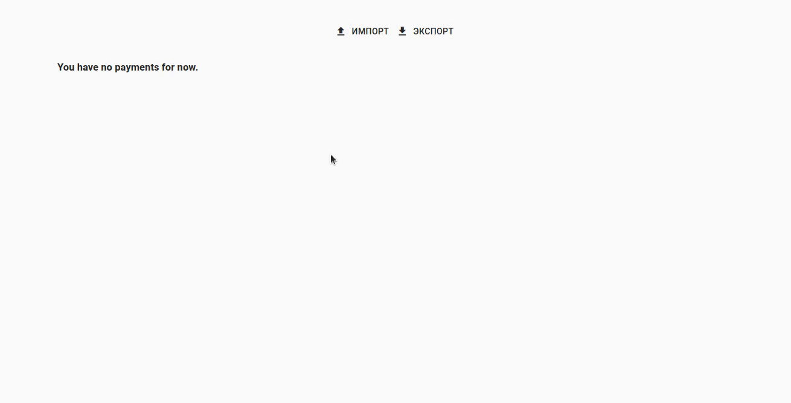

# Ledger

Эта штука помогает заполнять книгу доходов. Ей нужно скормить выписку с ПриватБанка (кнопка **Import**). Она группирует платежи по месяцу, кварталу и году. Далее monkey-job: переписать клетка в клетку цифры.

> Предполагается, что доход в одной валюте, без возвратов и подходящий по КВЭДам.

## Как это выглядит?



> Используй **demo.csv** как пример выписки с Привата (правда, у них кодировка cp1251, здесь же utf-8, но это не принципиально: сервер пытается парсить обе).

## Как использовать?

``` bash
$ docker run -p 5000:5000 --name ledger woopzzz/ledger:latest
```

## Как разрабатывать?

Лучший вариант: **Remote - Containers** плагин для VS Code. Нужно открыть проект (**.devcontainer** должен быть в корне). Запустить команду **Run in Container**.

> Flask приложение можно запустить таской с **launch.json** (и использовать дебагер).

> React приложение запускается через `npm start` (**package.json** должен быть в текущей директории).
